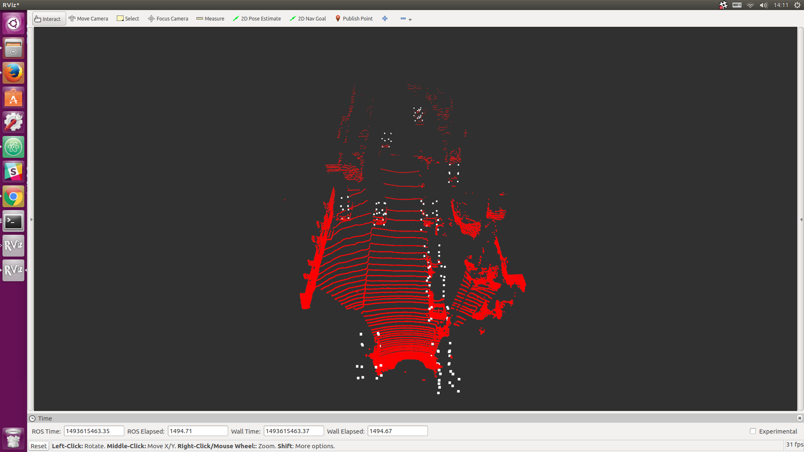
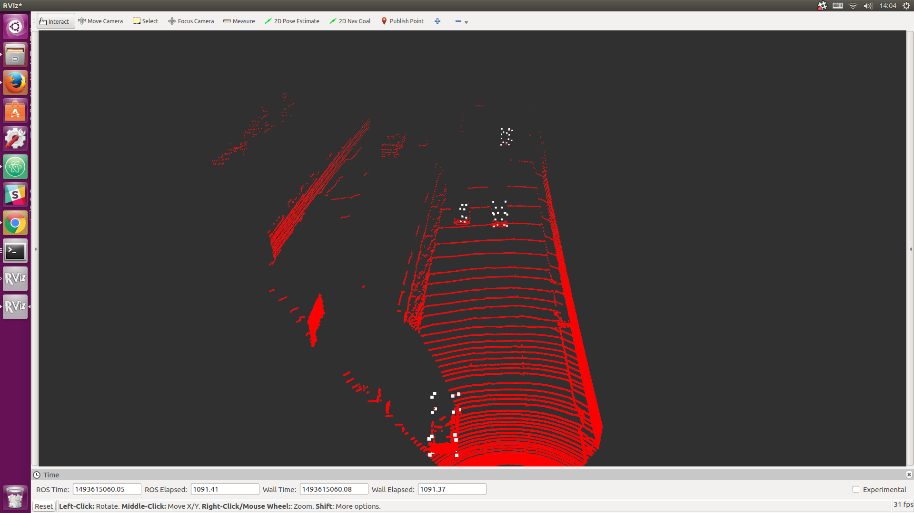

# Vehicle Detection using 3D Convolutional Neural Networks

A deep learning implementation for detecting vehicles in 3D point cloud data using Fully Convolutional Networks (FCN). This project implements the methodology described in the paper ["3D Fully Convolutional Network for Vehicle Detection in Point Cloud"](https://arxiv.org/pdf/1611.08069.pdf).

## 🚀 Features

- 3D vehicle detection using point cloud data
- Fully Convolutional Network architecture
- Support for KITTI dataset processing
- Real-time detection capabilities
- 3D bounding box prediction (8 vertices)

## 📋 Prerequisites

- Python
- TensorFlow
- ROS (Robot Operating System)
- Python-PCL (Optional - can be disabled in `input_velodyne.py`)

## 🛠️ Installation

1. Clone this repository
2. Install the required dependencies:
   ```bash
   pip install tensorflow ros-noetic python-pcl
   ```
   Note: ROS installation may vary based on your operating system

## 📊 Dataset

This project uses the [KITTI 3D Object Detection Dataset](http://www.cvlibs.net/datasets/kitti/eval_object.php?obj_benchmark=3d). You'll need:

- Velodyne Point Cloud data
- Training labels
- Calibration files

## 💻 Implementation

The project consists of two main components:

- `model_01_deconv.py`: Main implementation of the 3D CNN architecture
- `input_velodyne.py`: Data loading and preprocessing functionality

## 🖼️ Results

Below are example outputs showing 3D bounding box detection (8 vertices) without NMS (Non-Maximum Suppression):




## 📝 Citation

If you use this code in your research, please cite:

```bibtex
@article{3dfcn2016,
  title={3D Fully Convolutional Network for Vehicle Detection in Point Cloud},
  journal={arXiv preprint arXiv:1611.08069},
  year={2016}
}
```

## 📄 License

This project is open source and available under the MIT License.

## 👥 Contributing

Contributions are welcome! Please feel free to submit a Pull Request.
